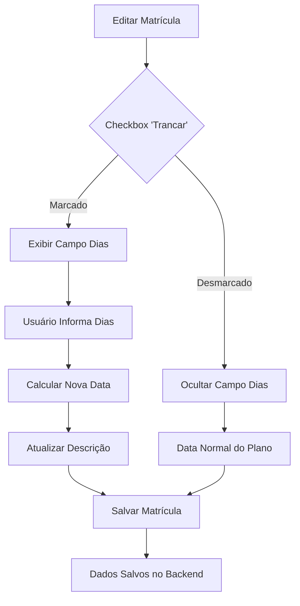

# 🔒 Controle de Trancamento de Matrículas - Testes

## ✅ Funcionalidade Implementada

### **Trancamento de Matrícula**
- ✅ **Checkbox "Trancar":** Permite ativar/desativar o trancamento
- ✅ **Campo "Quantidade de dias":** Aparece apenas quando "Trancar" está marcado
- ✅ **Cálculo automático:** Adiciona os dias na data de término
- ✅ **Feedback visual:** Mostra os dias adicionados na descrição da data de término

## 🔧 Implementação Técnica

### **Tipos Atualizados:**
```typescript
interface Subscription {
  // ... campos existentes
  locked?: boolean;        // Indica se está trancada
  lockDays?: number;      // Quantidade de dias de trancamento
}

type SubscriptionFormData = {
  // ... campos existentes
  locked: boolean;
  lockDays?: number;
}
```

### **Schema de Validação:**
```typescript
const createFormSchema = () => {
  return z.object({
    // ... campos existentes
    locked: z.boolean().default(false),
    lockDays: z.number().min(1, "Deve ser pelo menos 1 dia").optional(),
  });
};
```

### **Cálculo da Data de Término:**
```typescript
useEffect(() => {
  const planType = form.watch("plan");
  const startDateString = form.watch("startDate");
  const locked = form.watch("locked");
  const lockDays = form.watch("lockDays");

  if (planType && startDateString) {
    const planInfo = plans.find(p => p.type === planType);
    if (planInfo) {
      let calculatedEndDate = addMonths(startDate, planInfo.durationMonths);
      
      // Adicionar dias de trancamento se aplicável
      if (locked && lockDays && lockDays > 0) {
        calculatedEndDate = new Date(calculatedEndDate.getTime() + (lockDays * 24 * 60 * 60 * 1000));
      }
      
      setEndDate(calculatedEndDate);
    }
  }
}, [form.watch("plan"), form.watch("startDate"), form.watch("locked"), form.watch("lockDays"), plans]);
```

### **Conversão Database ↔ App:**
```typescript
// Database para App
export const dbToAppSubscription = (dbSubscription: any): Subscription => ({
  // ... campos existentes
  locked: dbSubscription.locked ?? false,
  lockDays: dbSubscription.lock_days || undefined,
});

// App para Database
export const appToDbSubscription = (subscription: Partial<Subscription>) => {
  // ... outros campos
  if (subscription.locked !== undefined) result.locked = subscription.locked;
  if (subscription.lockDays !== undefined) result.lock_days = subscription.lockDays;
  return result;
};
```

## 🎯 Interface do Usuário

### **Campo "Trancar":**
```
┌─────────────────────────────────────────────────────┐
│ ☐ Trancar                                           │
│   Trancar matrícula por um período determinado     │
└─────────────────────────────────────────────────────┘
```

### **Campo "Quantidade de dias" (aparece quando trancado):**
```
┌─────────────────────────────────────────────────────┐
│ Quantidade de dias para trancamento                 │
│ [      30      ] ← Ex: 30                           │
│ Os dias serão adicionados à data de término         │
│ da matrícula                                        │
└─────────────────────────────────────────────────────┘
```

### **Data de Término Atualizada:**
```
┌─────────────────────────────────────────────────────┐
│ Data de Término                                     │
│ [    15/04/2024    ] ← Calculada automaticamente   │
│ Data calculada automaticamente com base no plano   │
│ + 30 dias de trancamento                            │
└─────────────────────────────────────────────────────┘
```

## 🧪 Casos de Teste

### **Cenário 1: Ativar Trancamento**
1. **Ação:** Editar uma matrícula existente
2. **Ação:** Marcar checkbox "Trancar"
3. **Resultado:** ✅ Campo "Quantidade de dias" aparece
4. **Verificação:** Campo está vazio inicialmente

### **Cenário 2: Informar Dias de Trancamento**
1. **Situação:** Checkbox "Trancar" marcado
2. **Ação:** Digitar "30" no campo quantidade de dias
3. **Resultado:** ✅ Data de término atualizada automaticamente
4. **Verificação:** Descrição mostra "+ 30 dias de trancamento"

### **Cenário 3: Desativar Trancamento**
1. **Situação:** Trancamento ativo com 30 dias
2. **Ação:** Desmarcar checkbox "Trancar"
3. **Resultado:** ✅ Campo de dias desaparece
4. **Resultado:** ✅ Data de término volta ao normal
5. **Verificação:** Valor de lockDays é limpo (undefined)

### **Cenário 4: Validação de Dias Mínimos**
1. **Situação:** Checkbox "Trancar" marcado
2. **Ação:** Tentar informar "0" ou valor negativo
3. **Resultado:** ❌ Erro: "Deve ser pelo menos 1 dia"
4. **Verificação:** Formulário não permite envio

### **Cenário 5: Cálculo Correto das Datas**
1. **Situação:** 
   - Plano: Mensal (1 mês)
   - Data início: 01/01/2024
   - Trancamento: 15 dias
2. **Resultado:** 
   - Data término sem trancamento: 01/02/2024
   - Data término com trancamento: 16/02/2024
3. **Verificação:** ✅ 15 dias adicionados corretamente

### **Cenário 6: Salvar Matrícula Trancada**
1. **Ação:** Criar/editar matrícula com trancamento de 20 dias
2. **Ação:** Salvar formulário
3. **Resultado:** ✅ Dados salvos no backend
4. **Verificação:** 
   - `locked: true`
   - `lock_days: 20`
   - Data de término com dias adicionados

### **Cenário 7: Carregar Matrícula Trancada Existente**
1. **Situação:** Matrícula já salva com trancamento
2. **Ação:** Abrir formulário de edição
3. **Resultado:** ✅ Checkbox "Trancar" marcado
4. **Resultado:** ✅ Campo dias preenchido com valor salvo
5. **Verificação:** Data de término exibe valor correto

## 📊 Exemplos de Cálculo

### **Plano Mensal + 30 dias:**
```
Data Início:    01/01/2024
Duração Plano:  1 mês
Data Base:      01/02/2024
Trancamento:    + 30 dias
Data Final:     02/03/2024
```

### **Plano Trimestral + 15 dias:**
```
Data Início:    01/01/2024
Duração Plano:  3 meses
Data Base:      01/04/2024
Trancamento:    + 15 dias
Data Final:     16/04/2024
```

### **Plano Anual + 60 dias:**
```
Data Início:    01/01/2024
Duração Plano:  12 meses
Data Base:      01/01/2025
Trancamento:    + 60 dias
Data Final:     02/03/2025
```

## 🎨 Comportamentos Específicos

### **Campo Condicional:**
- ✅ **Quando "Trancar" desmarcado:** Campo de dias oculto
- ✅ **Quando "Trancar" marcado:** Campo de dias aparece
- ✅ **Ao desmarcar:** Valor de dias é limpo automaticamente

### **Atualização em Tempo Real:**
- ✅ **Mudança de plano:** Recalcula data com trancamento
- ✅ **Mudança de data início:** Recalcula data com trancamento  
- ✅ **Mudança de dias:** Atualiza data imediatamente
- ✅ **Ativar/desativar:** Atualiza descrição da data

### **Feedback Visual:**
- ✅ **Descrição dinâmica:** Mostra dias adicionados quando aplicável
- ✅ **Placeholder:** "Ex: 30" no campo de dias
- ✅ **Texto explicativo:** "Os dias serão adicionados à data de término"

### **Persistência de Dados:**
- ✅ **Novo campo:** `locked` (boolean)
- ✅ **Novo campo:** `lock_days` (integer, nullable)
- ✅ **Compatibilidade:** Valores padrão para registros existentes

## 🛡️ Validações Implementadas

### **Campo Obrigatório:**
- **lockDays:** Opcional quando `locked = false`
- **lockDays:** Validado quando `locked = true` e valor informado

### **Validação de Valor:**
- **Mínimo:** 1 dia
- **Tipo:** Número inteiro
- **Máximo:** Sem limite (pode ser definido se necessário)

### **Lógica Condicional:**
- **Campo só aparece quando necessário**
- **Valor é limpo ao desativar trancamento**
- **Data recalculada automaticamente**

## 🔄 Fluxo de Uso



## 🎯 Resultado Final

**Interface intuitiva que permite:**
1. ✅ **Ativar trancamento** com checkbox simples
2. ✅ **Informar quantidade de dias** facilmente  
3. ✅ **Ver resultado imediato** na data de término
4. ✅ **Salvar/carregar** dados corretamente
5. ✅ **Validação automática** de valores
6. ✅ **Feedback visual** claro e informativo

**A funcionalidade está completa e pronta para uso!**
