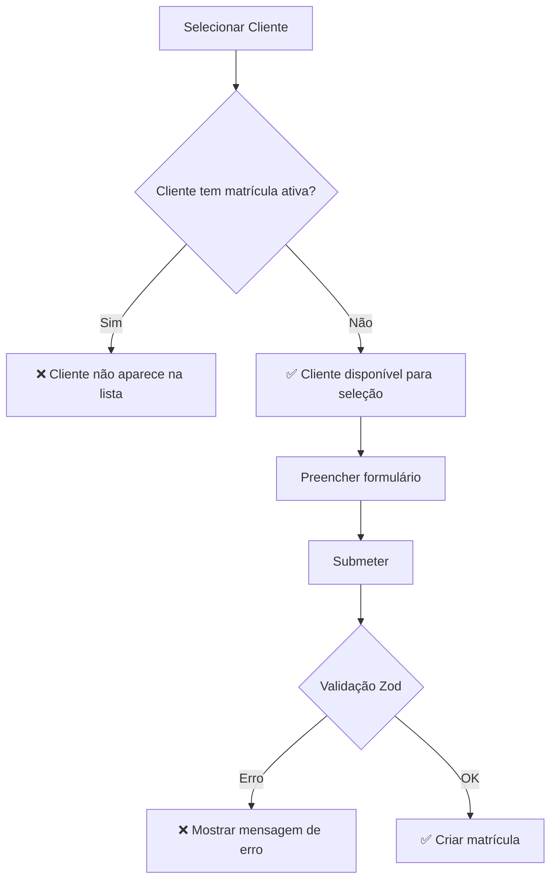

# 🔒 Validação de Matrículas Duplicadas - Testes

## ✅ Funcionalidade Implementada

### **Regra de Negócio:**
- Um cliente **NÃO PODE** ter múltiplas matrículas ativas simultaneamente
- A validação verifica a **data de vencimento** da matrícula com a **data atual**
- Matrícula é considerada ativa se: `subscription.active = true` E `endDate > now`

### **Pontos de Validação:**

#### **1. Schema Zod (Validação no Frontend):**
```typescript
clientId: z.string().refine((clientId) => {
  // Verificar se o cliente já possui matrícula ativa
  const now = new Date();
  const activeSubscription = existingSubscriptions.find(sub => 
    sub.clientId === clientId && 
    sub.active && 
    new Date(sub.endDate) > now
  );
  
  return !activeSubscription;
}, {
  message: "Este cliente já possui uma matrícula ativa. Aguarde o vencimento da atual."
})
```

#### **2. Filtro de Clientes Disponíveis:**
```typescript
const availableClients = clients.filter(client => {
  // Se estiver editando, permitir o cliente atual
  if (defaultValues?.clientId === client.id) return true;
  
  // Caso contrário, apenas clientes sem matrícula ativa
  return !clientHasActiveSubscription(client.id);
});
```

## 🧪 Casos de Teste

### **Cenário 1: Novo Cliente (✅ Permitido)**
- **Situação:** Cliente sem nenhuma matrícula
- **Resultado:** ✅ Pode criar matrícula normalmente
- **Interface:** Cliente aparece na lista de seleção

### **Cenário 2: Cliente com Matrícula Ativa (❌ Bloqueado)**
- **Situação:** Cliente com matrícula `active: true` e `endDate > hoje`
- **Resultado:** ❌ Não pode criar nova matrícula
- **Interface:** Cliente NÃO aparece na lista de seleção
- **Mensagem:** "Este cliente já possui uma matrícula ativa..."

### **Cenário 3: Cliente com Matrícula Vencida (✅ Permitido)**
- **Situação:** Cliente com matrícula `active: true` mas `endDate < hoje`
- **Resultado:** ✅ Pode criar nova matrícula
- **Interface:** Cliente aparece na lista de seleção

### **Cenário 4: Cliente com Matrícula Inativa (✅ Permitido)**
- **Situação:** Cliente com matrícula `active: false`
- **Resultado:** ✅ Pode criar nova matrícula
- **Interface:** Cliente aparece na lista de seleção

### **Cenário 5: Editando Matrícula Existente (✅ Permitido)**
- **Situação:** Editando a própria matrícula do cliente
- **Resultado:** ✅ Pode editar normalmente
- **Interface:** Cliente atual sempre disponível no select

## 📋 Validações Implementadas

### **No Formulário (SubscriptionForm.tsx):**
- ✅ Schema Zod com validação personalizada
- ✅ Filtro de clientes disponíveis
- ✅ Mensagem de erro específica
- ✅ Exceção para edição da mesma matrícula

### **Na Lista de Seleção (Subscriptions.tsx):**
- ✅ Filtro automático de clientes sem matrícula ativa
- ✅ Mensagem informativa quando não há clientes disponíveis
- ✅ Diferenciação entre "nenhum cliente encontrado" vs "todos têm matrícula ativa"

## 🎯 Fluxo de Validação



## 🛡️ Proteções Implementadas

### **Frontend:**
- **Filtro Preventivo:** Clientes com matrícula ativa não aparecem na lista
- **Validação de Formulário:** Schema Zod impede submissão
- **Feedback Visual:** Mensagens claras para o usuário

### **Componente Utilitário:**
- **ActiveSubscriptionAlert:** Componente para mostrar alertas sobre matrículas ativas
- **useActiveSubscriptionCheck:** Hook para verificar matrículas ativas em outros locais

## 📱 Interface de Usuário

### **Lista de Clientes Vazia:**
```
┌─────────────────────────────────────┐
│ Nenhum cliente disponível           │
│ Todos os clientes já possuem        │
│ matrículas ativas                   │
└─────────────────────────────────────┘
```

### **Erro no Formulário:**
```
┌─────────────────────────────────────┐
│ ❌ Este cliente já possui uma        │
│    matrícula ativa. Aguarde o       │
│    vencimento da atual.             │
└─────────────────────────────────────┘
```

## 🔄 Casos Especiais

### **Matrícula Vencendo Hoje:**
- **Data:** `endDate = hoje`
- **Status:** Ainda considerada ativa
- **Comportamento:** Bloqueia nova matrícula

### **Múltiplas Matrículas Inativas:**
- **Situação:** Cliente com várias matrículas `active: false`
- **Comportamento:** Permite criar nova matrícula

### **Edição vs Criação:**
- **Criação:** Validação rigorosa
- **Edição:** Permite alterar a matrícula atual do cliente
